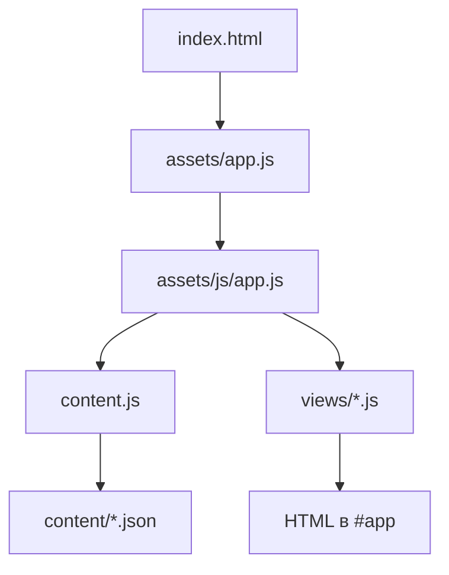

# Архитектура

## Публичный сайт

`index.html` загружает `assets/app.js`. Этот файл намеренно короткий и
передаёт управление `assets/js/app.js`.

Порядок запуска:

1. `content.js` параллельно загружает основные JSON-файлы.
2. По списку `content/projects/index.json` загружаются проекты.
3. Результат записывается в `state.content`.
4. Роутер в `app.js` выбирает модуль из `views/`.
5. View возвращает HTML, после чего `app.js` подключает интерактивные события.

### Правила модулей

- `views/` формируют HTML конкретных страниц.
- `components.js` содержит только повторно используемые части разметки.
- `utils.js` содержит небольшие общие функции без отрисовки страниц.
- `content.js` — единственное место публичного сайта, которое загружает JSON.
- `state.js` хранит только состояние текущей вкладки.
- Пользовательский текст перед вставкой в HTML проходит через `escapeHTML`.

## Админка

`admin/admin.js` передаёт управление `admin/js/app.js`.

- `vault.js` шифрует и расшифровывает токен локально.
- `github.js` выполняет все запросы к GitHub API.
- `editor.js` рисует формы и собирает изменённые значения.
- `app.js` связывает кнопки, формы, загрузки и сохранение.
- `config.js` содержит репозиторий, ветку и лимиты.

Расшифрованный токен не записывается в код или JSON. Он существует только в
памяти вкладки до блокировки/закрытия админки.

## Добавление новой страницы

1. Создай модуль в `assets/js/views/`.
2. Экспортируй из него функцию `render...`, возвращающую HTML.
3. Добавь маршрут в `assets/js/config.js`.
4. Импортируй renderer в `assets/js/app.js`.
5. Добавь выбор renderer в функции `currentPage()`.
